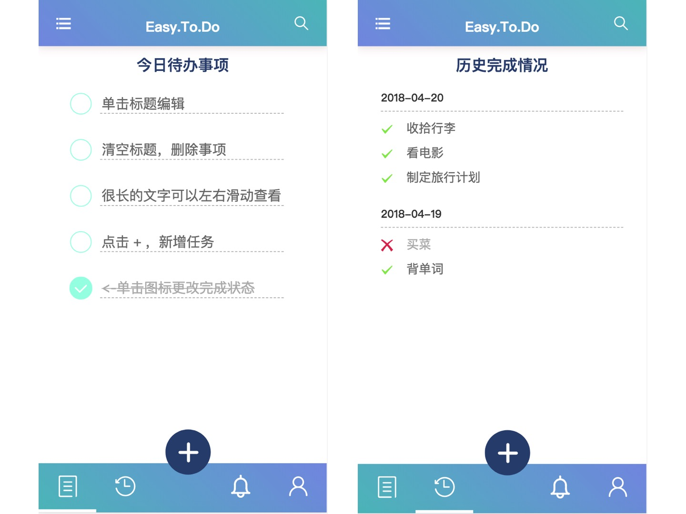
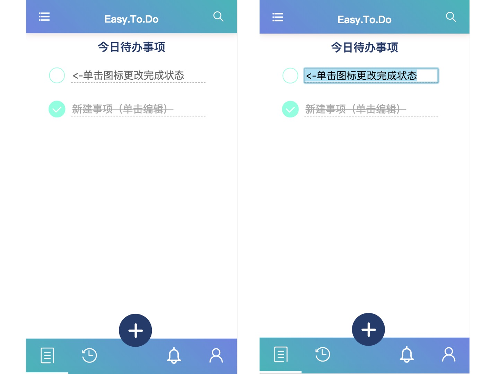

# NEJ-Easy.To.Do

## 体验
可以手机访问（PC端请打开手机模拟）：[点此跳转](http://easyread.top:5050/#/today/)

或者扫二维码体验一下：


## 预览




## 介绍

这是一款基于网易[NEJ](https://github.com/genify/nej)框架构建的ToDo应用Demo，该应用主要运行在手机端，电脑端运行请打开调试模式，使用手机端模拟。

主要功能：

- 每日事务管理（增加，修改，删除，标记完成）
- 待办事项本地存储
- 待办事务查询（待做
- 历史完成情况
- 提醒事项


主要特点：

- 基于NEJ（方便熟悉NEJ）
- 使用模块化开发（方便了解NEJ模块加载）
- 使用了JST模板
- 按需加载（反正都是NEJ提供的）
- 有较多注释（在学习阶段还是多看注释的好，赞一下NEJ的API源代码中的详细注释）
- 未使用现成控件（我也不知道这算不算特点，本来功能就简单）
- 没了


## 使用方法

直接静态运行webapp/src/html/app.html 即可，配合NEJ打包工具食用味道更佳。

```
npm install nej
```

然后在当前目录运行nej的build指令，在/webapp/pro/下生成打包后的文件

```
nej build ./deploy/release.conf
```


## NEJ相关学习

- define

