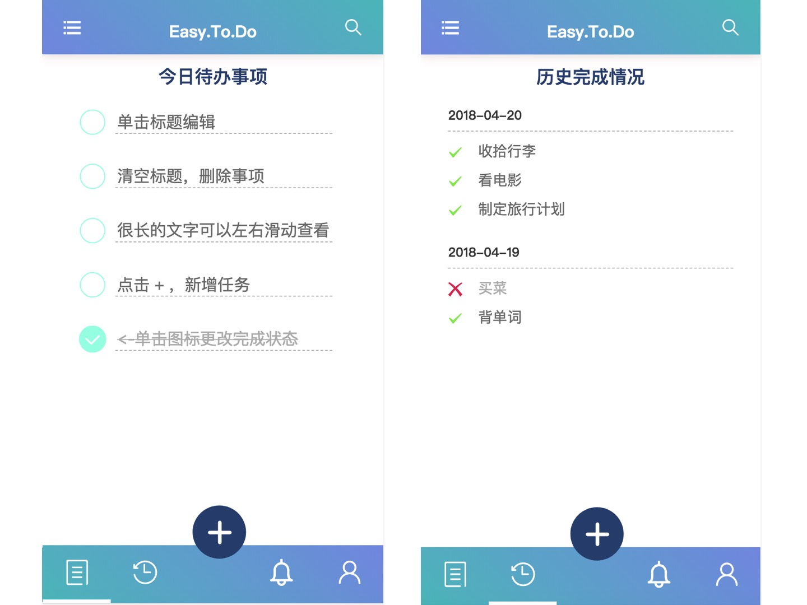

# NEJ-Easy.To.Do

# 体验

可以手机访问（PC端请打开手机模拟）：[点此跳转](http://easyread.top:5050/#/today/)

或者扫二维码体验一下：


# 预览




# 介绍

这是一款基于网易[NEJ](https://github.com/genify/nej)框架构建的ToDo应用Demo，该应用主要运行在手机端，电脑端运行请打开调试模式，使用手机端模拟。

主要功能：

- 每日事务管理（增加，修改，删除，标记完成）
- 待办事项本地存储
- 自动生成历史完成情况（当日完成情况过期后会自动进入历史完成情况）
- 待办事务查询（待做)
- 提醒事项（待做）


主要特点：

- 基于NEJ（方便熟悉NEJ）
- 数据本地存储
- 简化操作流程
- 使用模块化开发（方便了解NEJ模块加载）
- 使用了JST模板
- 按需加载（反正都是NEJ提供的）
- 有较多注释（在学习阶段还是多看注释的好，赞一下NEJ的API源代码中的详细注释）
- 未使用现成控件（我也不知道这算不算特点，本来功能就简单）
- 没了


# 使用方法

直接运行命令：
```
npm install
npm start
```
如果要进行发布构建运行命令：（前提已经安装的nej,如果没有安装nej请使用命令npm install nej安装）
```
npm run build
```
会自动在pro目录下生成构建完成的文件，文件可以直接丢到服务器上运行

# 项目说明

目录结构如下：

```
├── deploy ：部署相关的配置文件
├── node_modules 
├── photos
├── pro ：部署后生成文件
├── res
│   └── img
└── webapp ：源文件目录
    ├── css
    ├── javascript
    │   └── lib
    │       └── nej ：nej框架
    ├── module ：模块文件
    │   ├── m-btm
    │   ├── m-historylist
    │   ├── m-layout
    │   ├── m-profile
    │   ├── m-reminder
    │   └── m-todaylist
    ├── index.html ：项目入口
    └── res
        └── img
```

所有的修改都在webapp下，可以修改index.html增加模块，模块内容全在module文件夹下，模块的相关说明参考[NEJ相关学习](#nej相关学习)

# NEJ相关学习

## define

`NEJ.define()`是NEJ定义的异步加载模块的方式，和传统的[AMD](https://github.com/amdjs/amdjs-api/blob/master/AMD.md)方式类似，它可以方便的管理模块和它们之间的依赖关系，由于NEJ相关的模块都是得通过这种方式加载的，因此**这个define.js文件是最重要**的，需要最先引入。

相关介绍可以参考[NEJ依赖管理系统](https://github.com/genify/nej/blob/master/doc/DEPENDENCY.md)

另可以看[nej/define.js](https://github.com/genify/nej/blob/master/src/define.js) 源文件，上面有较多的注释，其中有几个关键的的点：

### 使用方法

引入nej.js或者define.js
```js
<script src="/path/to/nej/define.js"></script>
或
<script src="/path/to/nej/nes.js"></script>
```
然后通过NEJ.define使用,其中第一个参数是需要引入的模块**数组**, 第二个参数是回调函数，参数依次是引入的模块对象，后面4个`p,o,f,r`是四个额外变量,文档中有提及，其中**最重要的是p**，这个参数在自己定义模块的时候，用来扩展自己的模块。
```js
NEJ.define([
   'base/klass',
   'base/element'
],function(_k,_e,_p,_o,_f,_r){
})
```

### 模块路径

模块路径除了使用相对路径，绝对路径外，还可以配置指定前缀在引入define.js文件的时候可以制定参数路径。如下就是配置了变量A前缀指向../web/js/
```html
<script src="/path/to/nej/define.js?A=../web/js/"></script>
```
则文件定义时可以直接使用A或者”{A}”来表示A指定的路径前缀,**其中使用`{}`方式，末尾要标名文件类型**
```js
NEJ.definAe([
    'A/api/util',
    '{A}api/util.js'
……
```

### 常用模块

如果是控件，可以根据名字去`util/`目录下翻

### 自定义模块

每个模块文件只能定义一个模块，使用一次NEJ.define，源代码中说明了下面三种方式：
```javascript
 // 依赖base/global和base/util
 NEJ.define([
    'base/global',
    'base/util'
 ],function(NEJ,u,p,o,f,r){
     return p;
 });
```
```javascript
 // 不依赖其他文件，等价于直接执行
 NEJ.define(function(p,o,f,r){
     // TODO something
     return p;
 });
```
```javascript
 // 仅用于引入依赖文件列表而不执行业务逻辑
 NEJ.define(['base/global']);
```
需要在模块中添加的方法，就直接添加在p上就行了
```javascript
NEJ.define(function(p,o,f,r){
     p._doSth = function(){
     }
     return p;
 });
```

### 模块依赖

- 避免出现强依赖
- 基本如果是使用NEJ.define方式定义的模块（如下）都需要额外通过配置定义依赖关系
- 如果是非AMD规范的第三方库如需引入依赖管理，通过NEJ.deps()定义依赖关系，详细看[NEJ依赖管理系统](https://github.com/genify/nej/blob/master/doc/DEPENDENCY.md)


## 模块化开发

关于这一方面，文档写的很长，看着有点绕，这里做一个简单的入门小教程（可能不够严谨）要深入了解可以仔细阅读文档和源码，一般来说使用模块无外乎需要知道以下几点：
- 模块如何定义
- 模块如何渲染使用
- 模块间如何通信

### 模块如何定义

通常来说一个模块由样式布局（css），页面结构（html)，功能逻辑（js）三部分组成，NEJ中的模块也是这样，一个模块可以由三个文件构成，并通过NEJ模板系统进行加载渲染。
```
m-todaylist
├── index.css
├── index.js
└── index.html
```
其中css文件按照普通方式书写，html中模板的内容通过<textarea></textarea>包装(具体格式参考:[模板系统](https://github.com/genify/nej/blob/master/doc/TEMPLATE.md))并给出特定的ID标识。然后引入样式和逻辑，所以一个模板大概是下面这个样子：
```javascript
<meta charset="utf-8"/>
<textarea name="txt" id="module-id-reminder">
    <h3>提醒</h3>
    <div class="content" id="reminder-content">
      敬请期待
    </div>
</textarea>
<textarea name="css" data-src="./index.css"></textarea>
<textarea name="js"  data-src="./index.js"></textarea>
```

其中js文件比较重要，它定义了一个模块各阶段的行为，其中NEJ定义了模块的四个阶段：
- 构建 - __doBuild：构建模块结构，缓存模块需要使用的节点，初始化组合控件的配置参数
- 显示 - __onShow：将模块放置到指定的容器中，分配组合控件，添加相关事件，执行__onRefresh的业务逻辑
- 刷新 - __onRefresh：根据外界输入的参数信息获取数据并展示（这里主要做数据处理）
- 隐藏 - __onHide：模块放至内存中，回收在__onShow中分配的组合控件和添加的事件，回收__onRefresh中产生的视图（这里尽量保证执行完成后恢复到__doBuild后的状态）

首先你需要新建一个模块的实例化对象，可以使用以下代码，保存成module.js，放到nej库目录下或者自己的js文件目录下。
```js
NEJ.define([
    'base/klass',
    'util/dispatcher/module'
],function(_k,_t,_p){
    _p._$$Module = _k._$klass();
    _pro = _p._$$Module._$extend(_t._$$ModuleAbstract);
    return _p;
});
```

然后，通过可以参考下面这个模板，构建属于自己的模块，其中重要的部分都已经通过注释标明了

```javascript
NEJ.define([
   'base/klass',
   'base/element',
   'util/template/tpl',
   'util/template/jst',
   'util/dispatcher/module',
   'path/to/module'
],function(_k,_e,_t0,_j,_t1,_m,_p,_o,_f,_r){
   var _pro;
   _p._$$ModuleLayoutSystem = _k._$klass();
   _pro = _p._$$ModuleLayoutSystem._$extend(_m._$$Module);

   //最外层的模块需要定义挂载点,其他的子模块不需要这一部分
   _pro.__doParseParent = function(_options){
      return _e._$get('md-box');
   };

   _pro.__doBuild = function(){
       // 这里主要是做数据初始化操作，千万别在这里做页面渲染或者DOM相关操作，此时页面
       // 内的元素都没加载出来
       this.__body = _e._$html2node(
           _t0._$getTextTemplate('module-id-test')  // 这个地方载入的模板Id
       );
        // 这一块可有可无，主要是看你的模块会不会嵌套其他模块，通过__export，把接口预留出来，
        // 然后在使用的时候，通过composite: {}组合
        //    var _list = _e._$getByClassName(this.__body,'j-flag');

        //    this.__export = {
        //        tab:_list[0],
        //        parent:_list[1]
        //    };
   };
   _pro.__onShow = function(_options){
        this.__super(_options);
        // 这里放显示相关的操作，特别注意，在这之后，页面内的元素才出现，才能操作DOM
   };

   _pro.__onRefresh = function(_options){
        this.__super(_options);
        // 可以做根据数据相关的页面刷新相关的操作，比如列表刷新什么的，可以通过
        // this.__events.onrefresh(options)调用刷新
   };

    _pro.__onHide = function(){
        this.__super();
        // 表示页面隐藏后的操作
    };

   // 这里是模块全局注册的id，到时候模块使用的需要用，全局唯一
   _t1._$regist('layout-test',_p._$$ModuleLayoutSystem);
});
```


### 模块如何使用

主页提供一个挂载点（之前说的主模块需要通过`__doParseParent`，挂载到该挂载点），然后通过 `___$startup`配置应用，主要是配置以下内容：

- rules 规则配置

  - rewrite {a:b}：用b页面重写a页面
  - title {a:b}：当进入a页面的时候，出现b标题
  - alias {id:umi}: **这里比较重要，就是将之前我们注册的全局id跟特定的UMI进行绑定。** UMI定义的规则是：必须以“/”符开始，私有模块必须以“/?”开始。一般来说/m定义成主模块，然后UMI会体现依赖规则： /m/m0/ 和 /m/m1/ 表明这两个标识对应模块的父模块标识均为 /m

- modules 模块配置 

  - 配置每个模块UMI对应的html地址，其中如果是单独的模块，可以直接接地址：

    ```js
    '/?/top/': 'module/m-top/index.html',
    ```

  - 如果内部包含子模块，则使用以下形式（其中`/?/top/`和`/?/top/`需要在之前定义）

    ```js
    '/m': {
        module: 'module/m-layout/index.html',
        composite: {
        top: '/?/top/',
        btm: '/?/btm/'
    	}
    }
    ```

  - 其中，如果模块的接口中暴露了`parent`接口，可以通过UMI的依赖关系，进行模块的载入（如下会把history这个模块载入`/m`的parent接口）

    ```js
      '/m/history/': 'module/m-historylist/index.html',
    ```

- onbeforechange 会在模块渲染前进行调用

所以一个主入口文件大概长成这样：

```html
<html>
<head>
……
</head>
<body>
  <div id="md-box"></div>
  <!-- @SCRIPT -->
  <script src="./javascript/lib/nej/define.js"></script>
  <script>
    NEJ.define([
      'util/dispatcher/dispatcher'
    ], function (_t) {
      /* start up dispatcher */
      _t._$startup({
        rules: {
          rewrite: {
            '404': '/m/today/',
            '/m/':'/m/today/'
          },
          title: {
              '/m/':'Easy.To.Do - by voidsky',
              '/m/today/':'Easy.To.Do - 今日待办',
              '/m/history/':'Easy.To.Do - 历史完成',
              '/m/reminder/':'Easy.To.Do- 提醒',
              '/m/profile/':'Easy.To.Do- 个人资料'
          },
          alias: {
            'layout-top': '/?/top/',
            'layout-hislist': '/m/history/',
            'layout-reminder': '/m/reminder/',
            'layout-profile': '/m/profile/',
            'layout-btm': '/?/btm/',
            'layout-todaylist': '/m/today/',
            'layout-system': '/m',
          }
        },
        modules: {
          '/?/top/': 'module/m-top/index.html',
          '/?/btm/': 'module/m-btm/index.html',
          '/m': {
            module: 'module/m-layout/index.html',
            composite: {
              top: '/?/top/',
              btm: '/?/btm/'
            }
          },
          '/m/history/': 'module/m-historylist/index.html',
          '/m/today/': 'module/m-todaylist/index.html',
          '/m/reminder/': 'module/m-reminder/index.html',
          '/m/profile/': 'module/m-profile/index.html',
        },
        onbeforechange: function (_options) {
          // do something
        }
      });
    });
  </script>
</body>

</html>
```

### 模块间通信

模块间的通信，NEJ处理的比较好，提供了两种通信方式

- 点对点(通过UMI)
- 发布订阅者模式

这个在[文档](https://github.com/genify/nej/blob/master/doc/DISPATCHER.md#%E6%B6%88%E6%81%AF)写的比较详细了


## 模块划分

我的思路是：一个模块做主模块（假设挂载的div的id为`md-box`）（挂载到页面上），然后该模块主要负责整体页面的布局（两栏，三栏……）例如一个两栏的布局，可能就是下面这样：

```html
<meta charset="utf-8"/>
<textarea name="txt" id="module-id-0">
    <div class="left"></div>
    <div class="content"></div>
</textarea>
<!-- @TEMPLATE -->
<textarea name="css" data-src="./index.css"></textarea>
<textarea name="js"  data-src="./index.js"></textarea>
```

`index.js`文件中通过`__doParseParent` 定义挂载点，然后对外通过`__export `提供接口，然后在主页面配置相关的模块结构，如下就把左右栏的接口暴露出去了：

```js
NEJ.define([
  'base/klass',
  'base/element',
  'util/template/tpl',
  'util/dispatcher/module',
  'path/to/module'
], function (_k, _e, _t0, _t1, _m, _p, _o, _f, _r) {
  var _pro;
  _p._$$ModuleLayoutSystem = _k._$klass();
  _pro = _p._$$ModuleLayoutSystem._$extend(_m._$$Module);

  //最外层的模块需要定义挂载点,其他的子模块不需要这一部分
  _pro.__doParseParent = function (_options) {
    return _e._$get('md-box');
  };

  _pro.__doBuild = function () {
    this.__body = _e._$html2node(
      _t0._$getTextTemplate('module-id-test')  // 这个地方载入的模板Id
    );
    this.__export = {
      tab: _e._$getByClassName(this.__body, 'left'),
      parent: _e._$getByClassName(this.__body, 'content')
    };
  };

  // 这里是模块全局注册的id，到时候模块使用的需要用，全局唯一
  _t1._$regist('layout-test', _p._$$ModuleLayoutSystem);
});
```

然后在入口配置相关参数，假设有一个tab模块和一个主页显示页面todaylist模块，其中这两个模块**都不需要通过`__doParseParent` 定义挂载点**，其中 tab模块通过left接口跟主模块进行组合（一般是不会根据url改变页面结构的部分，比如侧边栏，顶部banner，底栏……），然后today模块通过依赖关系进行注入，只有当页面地址改变到`#/today`的时候才会注入默认的`parent`接口

```html
<script>	
 _t._$startup({
        rules: {
		  ……
          alias: {
            'layout-tab': '/?/tab/',
            'layout-todaylist': '/m/today/',
            'layout-system': '/m',
          }
        },
        modules: {
          '/?/tab/': 'module/m-tab/index.html',
          '/m': {
            module: 'module/m-layout/index.html',
            composite: {
              top: '/?/top/'
            }
          },
          '/m/today/': 'module/m-todaylist/index.html',
        }
      });
    });
  </script>
</body>
</html>
```

